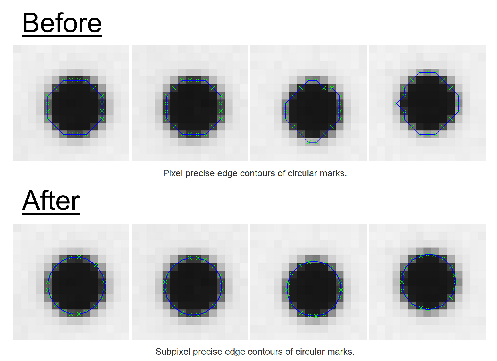
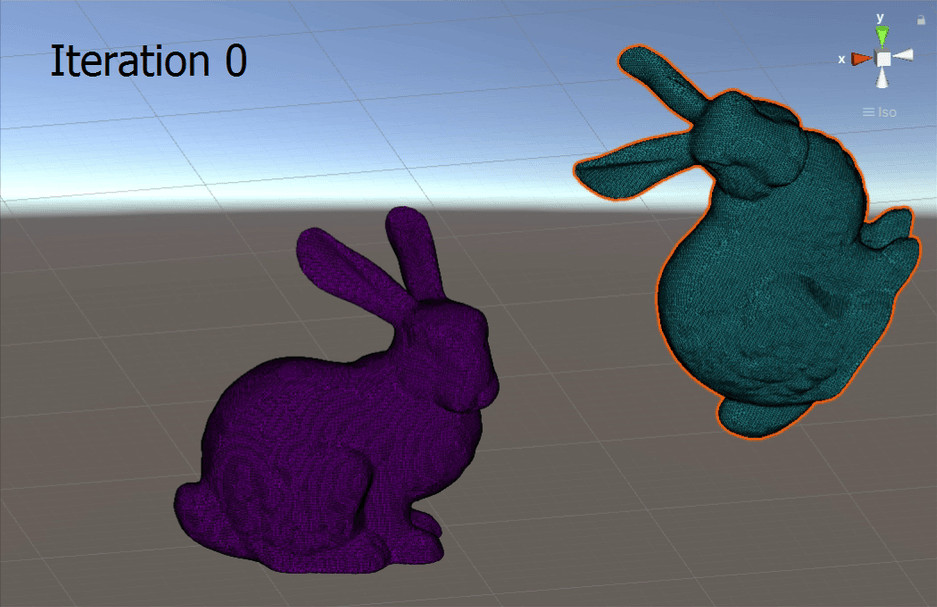
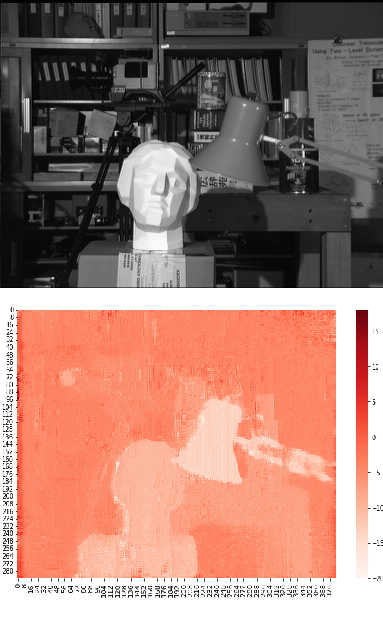

# raymondngiam.github.io
Profile page for Raymond Ngiam https://raymondngiam.github.io/

## Projects

||Description
|:-:|:-|
|**Isaac Sim Pick-and-Place Simulation** [[link]](https://raymondngiam.github.io/isaac-sim-pick-and-place-simulation/) - Simulate a pick-and-place application using Nvidia's Isaac Sim.
|**OpenCV Subpixel Edge Detection Project** [[link]](https://raymondngiam.github.io/subpixel-edge-contour-in-opencv/) - Implements subpixel edge detection with OpenCV in C++.
|**Dual Quaternion Interpolation in Unity** [[link]](https://raymondngiam.github.io/dual-quaternion-interpolation-in-unity) - Implements dual quaternion interpolation in C# and Unity. 
|**Iterative Closest Point with Nonlinear Least Squares** [[link]](https://raymondngiam.github.io//icp-with-nonlinear-least-squares) - Implements ICP algorithm with SE3 manifold based optimization with ceres-solver, and Sophus library in C++.
|**Total variation regularized Stereo Disparity in OpenCV** [[link]](https://raymondngiam.github.io/tv-regularized-stereo-disparity-in-opencv) -	Implements edge preserving dense stereo disparity computation with OpenCV in C++.
|**Self Driving Car Related Projects** [[link]](https://raymondngiam.github.io/CarND-Projects/) - Behavioral cloning, lane detection, localization, model predictive control, path planning, and ROS integration.

---
### Support my works

If these projects saved you time, helped you learn something new, or just made your day a little easier — consider buying me a coffee. Your support helps me keep building, documenting, and sharing works like these with the community.

---

<footer>
  
&copy; 2025 Raymond Ngiam. All rights reserved.

</footer>
